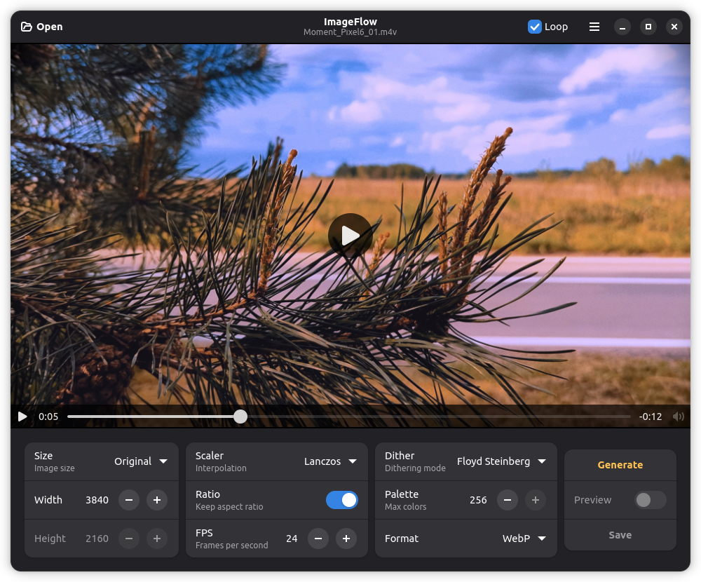

<!-- markdownlint-disable -->
<div align="center">
  
</div>
<h1 align="center">ImageFlow</h1>
<p align="center">Application for converting video files to high‑quality animated images.</p>
<p align="center">
  
</p>
<!-- markdownlint-enable -->


## Description

This application is designed for converting videos into animated GIF and WebP images using the FFmpeg library. You can configure key parameters, such as the output image size, frame rate, applied filters (interpolation method, dithering mode), palette generation method, and the maximum number of colors.

### Features

- All conversion parameters can be configured.
- Preview of the result.
- Support for many formats.
- Intuitive and user-friendly interface.

### ToDo

- [x] Initial release.
- [x] WebP encoding options.
- [ ] Improved viewing and previewing.
- [ ] The ability to select a time segment of a video file for conversion.


## Installation

The built packages are available on the [releases](https://github.com/GS90/ImageFlow/releases) page.

### Flatpak

The latest official release can be downloaded from Flathub.

<a href='https://flathub.org/apps/details/tech.digiroad.ImageFlow'></a>

### GNOME Builder

GNOME Builder offers the easiest method to build and test ImageFlow. Clone the repository and press the «Run Project» button to compile.

### Build from source

```
git clone https://github.com/GS90/ImageFlow
cd ImageFlow

meson setup build
ninja -C build install
```

By default, meson should install ImageFlow to `/usr/local`.


## License

ImageFlow is a [free software](https://www.gnu.org/philosophy/free-sw.html) and will always be free. It is released under the terms of the [GNU General Public License](./COPYING).


## Copyright

2026, [Golodnikov Sergey](https://github.com/GS90)
